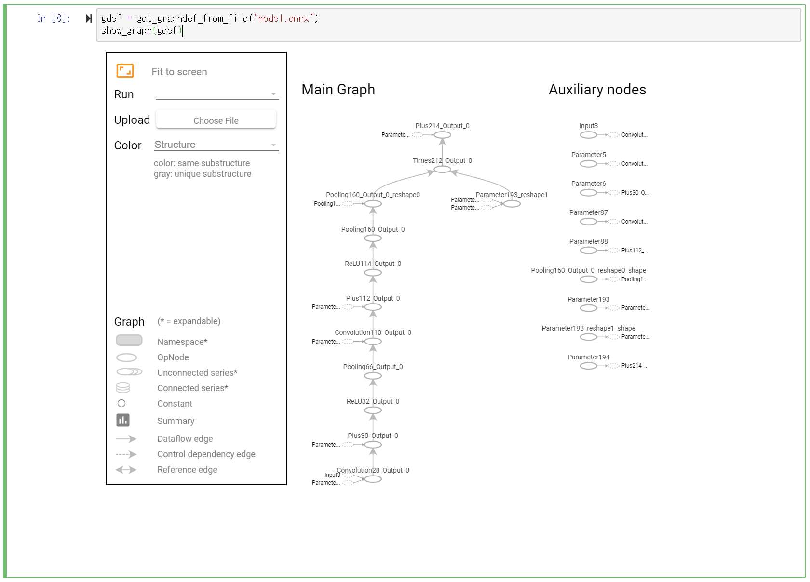
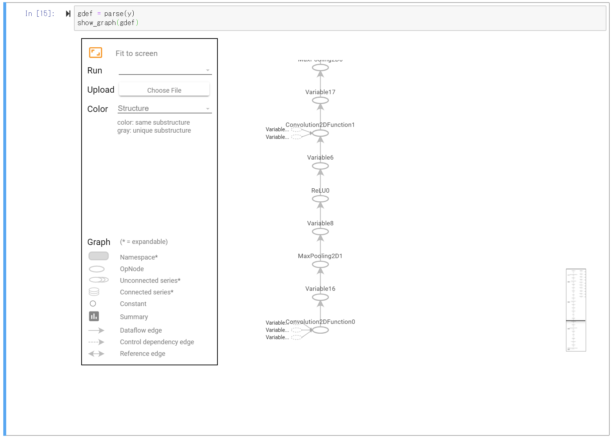
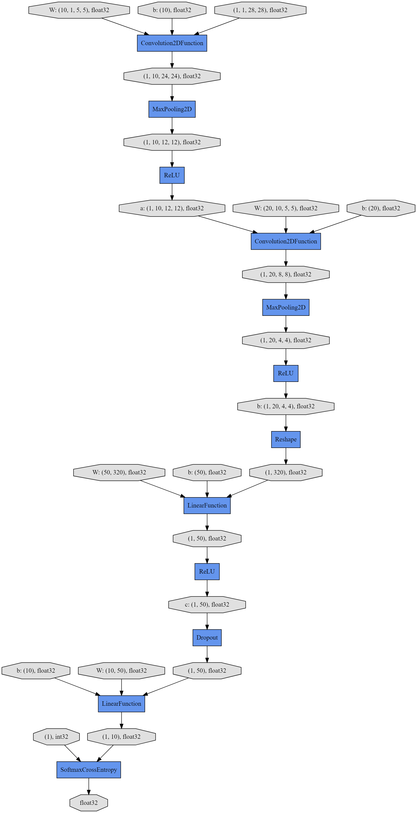

# Chainer のネットワークグラフを Jupyter Notebook で可視化する

[Chainer/CuPy Advent Calendar 2018](https://qiita.com/advent-calendar/2018/chainer) 21日の記事です。


## TL;DR

1. Tensorboard のグラフ表示部分のみを切り出して Jupyter Notebookで表示できる
2. それを利用して、ONNX と Chainer で作ったモデルを表示してみる
3. (宣伝) ChainerUI v0.8 に、画像と音声の表示が入った


## TensorBoard のグラフ可視化機能

Tensorflow の可視化ツールである TensorBoard には、ネットワークのグラフをブラウザで可視化する機能があります ([ドキュメントリンク](https://www.tensorflow.org/guide/graph_viz))。で、この機能を Jupyter Notebook で利用できることを最近知りました ([Stackoverflowのリンク](https://stackoverflow.com/questions/38189119/simple-way-to-visualize-a-tensorflow-graph-in-jupyter))。もしかしたら、tfユーザには有名な話で、日本語記事とかもあるかもしれません。

というわけで、そのコードを参考に、はじめは ONNX のグラフを表示してみます。ONNX から `tf.GraphDef` への変換は、[tensorboardX](https://github.com/lanpa/tensorboardX) を参考にしました。`tf.GraphDef` 等、 tf 用型定義ファイルは [tensorflow/tensorflow/core/framework](https://github.com/tensorflow/tensorflow/tree/master/tensorflow/core/framework) から必要な proto ファイルを持ってきて、 (コンパイルしたのちに) `graphviwer/proto` に配置したことします。

```Python
from graphviewer.proto.attr_value_pb2 import AttrValue
from graphviewer.proto.graph_pb2 import GraphDef
from graphviewer.proto.node_def_pb2 import NodeDef
from graphviewer.proto.tensor_shape_pb2 import TensorShapeProto
from graphviewer.proto.versions_pb2 import VersionDef

def get_graphdef_from_file(path):
    import onnx
    model = onnx.load(path)
    return parse(model.graph)


def parse(graph):
    nodes_proto, nodes = [], []
    import itertools
    for node in itertools.chain(graph.input, graph.output):
        nodes_proto.append(node)

    for node in nodes_proto:
        shapeproto = TensorShapeProto(
            dim=[TensorShapeProto.Dim(size=d.dim_value) for d in node.type.tensor_type.shape.dim])
        nodes.append(NodeDef(
            name=node.name.encode(encoding='utf_8'),
            op='Variable',
            input=[],
            attr={
                'dtype': AttrValue(type=node.type.tensor_type.elem_type),
                'shape': AttrValue(shape=shapeproto),
            }
        ))

    for node in graph.node:
        attr = []
        for s in node.attribute:
            attr.append(' = '.join([str(f[1]) for f in s.ListFields()]))
        attr = ', '.join(attr).encode(encoding='utf_8')
        nodes.append(NodeDef(
            name=node.output[0].encode(encoding='utf_8'),
            op=node.op_type,
            input=node.input,
            attr={'parameters': AttrValue(s=attr)},
        ))
    mapping = {}
    for node in nodes:
        mapping[node.name] = node.op + '_' + node.name

    return GraphDef(node=nodes, versions=VersionDef(producer=22))
```

*from https://github.com/lanpa/tensorboardX/blob/4e7bb739cb1a70191c58411d8a01536a82c9b4bd/tensorboardX/onnx_graph.py*

Jupyter Notebookに表示する iframe は上述の so の記事から持ってきます。

```Python
from IPython.display import display
from IPython.display import HTML
import numpy

from graphviewer.proto.graph_pb2 import GraphDef


def strip_consts(graph_def, max_const_size=32):
    """Strip large constant values from graph_def."""
    strip_def = GraphDef()
    for n0 in graph_def.node:
        n = strip_def.node.add()
        n.MergeFrom(n0)
        if n.op == 'Const':
            tensor = n.attr['value'].tensor
            size = len(tensor.tensor_content)
            if size > max_const_size:
                tensor.tensor_content = '<stripped {:d} bytes>'.format(size)
    return strip_def


def show_graph(graph_def, max_const_size=32):
    """Visualize TensorFlow graph."""
    if hasattr(graph_def, 'as_graph_def'):
        graph_def = graph_def.as_graph_def()
    strip_def = strip_consts(graph_def, max_const_size=max_const_size)
    code = """
        <script>
        function load() {{
            document.getElementById("{id}").pbtxt = {data};
        }}
        </script>
        <link rel="import" href="https://tensorboard.appspot.com/tf-graph-basic.build.html"
          onload=load()>
        <div style="height:600px">
        <tf-graph-basic id="{id}"></tf-graph-basic>
        </div>
    """.format(data=repr(str(strip_def)), id='graph'+str(numpy.random.rand()))

    iframe = """
        <iframe seamless style="width:960px;height:720px;border:0" srcdoc="{}"></iframe>
    """.format(code.replace('"', '&quot;'))
    display(HTML(iframe))
```

*from https://github.com/tensorflow/tensorflow/blob/master/tensorflow/examples/tutorials/deepdream/deepdream.ipynb*

ONNX 公式の models より、みんな大好き [MNIST のモデル](https://github.com/onnx/models/tree/master/mnist) を表示してみます。

```Python
gdef = get_graphdef_from_file('model.onnx')
show_graph(gdef)
```



なぜかグラフの向きが下から上ですが、ちゃんと表示されているように思えます。

なお、どうしても Jupyter Notebook 上で表示したい、というわけでなければ、ONNX の可視化は素直に [Netron](https://github.com/lutzroeder/netron) を使うのがいいと思います。

## Chainer モデルの可視化

Chainer で作ったモデルを同じく表示してみます。やることは簡単で、上の ONNX→`tf.GrafDef` の変換と同じように、Chainer の Node を変換すればいいだけです。Chainer に標準で入っている `computational_graph` を使います。

```Python
from collections import Counter

import chainer
from chainer.computational_graph import build_computational_graph

from graphviewer.parser.dtypes import convert_dtype


def parse(outputs):
    cgraph = build_computational_graph([outputs])

    nodes = []
    input_dict = {}
    for head, tail in cgraph.edges:
        input_dict.setdefault(id(tail), []).append(head)

    name_cnt = Counter()
    id_to_name = {}

    def name_resolver(node):
        name = id_to_name.get(id(node), None)
        if name is not None:
            return name
        if isinstance(node, chainer.variable.VariableNode):
            name = 'Variable{:d}'.format(name_cnt['Variable'])
            name_cnt['Variable'] += 1
        else:
            name = '{}{:d}'.format(node.label, name_cnt[node.label])
            name_cnt[node.label] += 1
        id_to_name[id(node)] = name
        return name

    for node in cgraph.nodes:
        assert isinstance(node, (
            chainer.variable.VariableNode, chainer.function_node.FunctionNode))

        if id(node) not in input_dict:
            shpeproto = TensorShapeProto(
                dim=[TensorShapeProto.Dim(size=s) for s in node.shape])
            nodes.append(NodeDef(
                name=name_resolver(node).encode(encoding='utf_8'),
                op='Variable',
                input=[],
                attr={
                    'dtype': AttrValue(type=convert_dtype(node.dtype)),
                    'shpae': AttrValue(shape=shpeproto),
                }
            ))
        else:
            inputs = [name_resolver(n).encode(encoding='utf_8') for n in input_dict[id(node)]]
            attr = node.label.encode(encoding='utf_8')  # TODO
            nodes.append(NodeDef(
                name=name_resolver(node).encode(encoding='utf_8'),
                op=node.__class__.__name__,
                input=inputs,
                attr={'parameters': AttrValue(s=attr)},
            ))
    return GraphDef(node=nodes, versions=VersionDef(producer=22))
```

簡単な解説

* `output` はモデルから出力された値です。(後述)
* node の名前は一意である必要があります。`id(node)` でもいいのですが、せっかく可視化するのに分かりにくのでは本末転倒なので、 `name_resolver` でそれっぽい感じにしています。
    * ここはあまり時間かけて考えてないので、もっとスマートなやり方がある気がします。
* `convert_dtype` は `numpy.dtype` を `tf.dtype` に変換する関数です。
* あとは大体、ONNXの時と同じです。

早速 Chainer のモデルを可視化してみます。やっぱりみんな大好き MNIST の分類器を雑に作ります。

```Python
import chainer.functions as F
import chainer.links as L

# Network definition
class Net(chainer.Chain):

    def __init__(self):
        super(Net, self).__init__()
        with self.init_scope():
            # the size of the inputs to each layer will be inferred
            self.conv1 = L.Convolution2D(None, 10, ksize=5)
            self.conv2 = L.Convolution2D(None, 20, ksize=5)
            self.l1 = L.Linear(None, 50)
            self.l2 = L.Linear(None, 10)

    def forward(self, x):
        x = F.relu(F.max_pooling_2d(self.conv1(x), 2))
        x = F.relu(F.max_pooling_2d(self.conv2(x), 2))
        x = F.relu(self.l1(x))
        x = F.dropout(x)
        return self.l2(x)

model = L.Classifier(Net())
```

Computational Graph を作るために、ダミーの `x` を与えて出力値を得ます。

```Python
x = chainer.Variable(numpy.random.rand(1, 1, 28, 28).astype(numpy.float32))
t = chainer.Variable(numpy.random.rand(1).astype(numpy.int32))
y = model(x, t)
```

`parse` に出力値を渡して、`tf.GraphDef` に変換し、可視化します。

```Python
gdef = parse(y)
show_graph(gdef)
```



dot と比べると、上下の方向と名前の違いはありますが、概ね合っていそうです。




## TensorBoard の表示名ルール (一部)

* node の名前にスラッシュ (`/`) が入っていると、scope としてみなされるため TensorBoard 側でうまく依存関係が解決できないです。
* node の名前の末尾に `_0` のように "`_` + 数字" をつけると、配列とみなされ、良しなにまとめられてしまいます。


## module としてまとめました

上記スクリプトをツールとして、このリポジトリにまとめました。興味ある方は [README](README.md) をご参照ください。

```bash
$ pip install git+https://github.com/disktnk/chainer-graphviewer
```


## (宣伝) ChainerUI v0.8 リリースしました。

内容とはこれっぽっちも関係ないのですが、ChainerUI v0.8 が 先週リリースされました。画像および音声をブラウザで見られるようになっています。[release note](https://github.com/chainer/chainerui/releases/tag/v0.8.0) に使用イメージがあるので、興味ある方はぜひ使ってみてください。


## まとめというかポエム

静的 HTML データを GAE に配置して、部分的に呼び出す、というアイディアは、自分の頭を逆さに振っても出なかったので、やっぱ Google さんは強いなぁ、と思いましたとさ。
