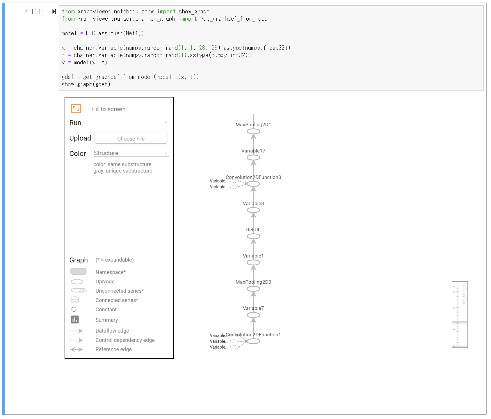
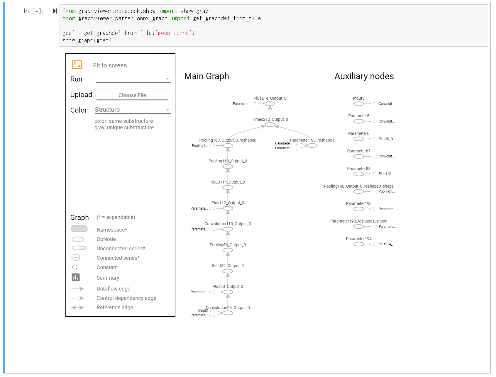

# Graph viewer on Jupyter Notebook for Chainer

## Install

```bash
$ pip install git+https://github.com/disktnk/chainer-graphviewer
```

* This tool is run on Jupyter Notebook
* if view ONNX model, need `$ pip install onnx`
* if view Chainer model, need `$ pip install chainer`
* if only use `show_graph`, Tensorflow user for example, don't have to install ONNX or Chainer module

## Example for Chainer

```Python
# Network definition
class Net(chainer.Chain):
    def __init__(self):
        pass
    # snip...

from graphviewer.notebook.show import show_graph
from graphviewer.parser.chainer_graph import get_graphdef_from_model

model = L.Classifier(Net())

x = chainer.Variable(numpy.random.rand(1, 1, 28, 28).astype(numpy.float32))
t = chainer.Variable(numpy.random.rand(1).astype(numpy.int32))
y = model(x, t)

gdef = get_graphdef_from_model(model, (x, t))
show_graph(gdef)
```




## Example for ONNX

show `model.onnx`

```Python
from graphviewer.notebook.show import show_graph
from graphviewer.parser.onnx_graph import get_graphdef_from_file

gdef = get_graphdef_from_file('model.onnx')
show_graph(gdef)
```




## `ipynb` Example

* [example_for_module](example_for_module.ipynb)
    * running example after install this repository
* [example_for_code_explain](example_for_code_explain.ipynb)
    * running example with detail scripts


## Prepare (for developer)

1. copy `*.proto`, current version is v1.12.0, put `graphviewer/proto/`
1. `$sed -i -e 's|"tensorflow/core/framework|"graphviewer/proto|g' graphviewer/proto/*.proto`
1. `protoc --python_out=./ ./graphviewer/proto/*.proto`
